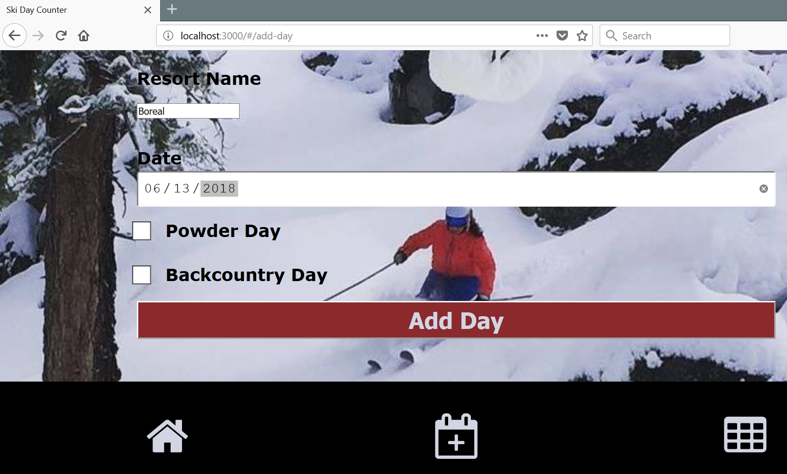
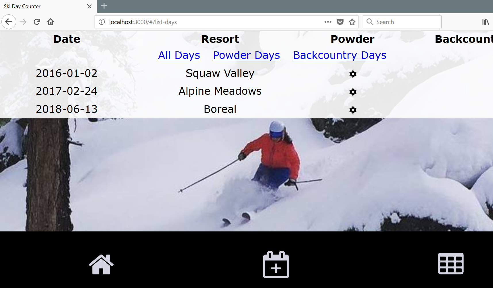
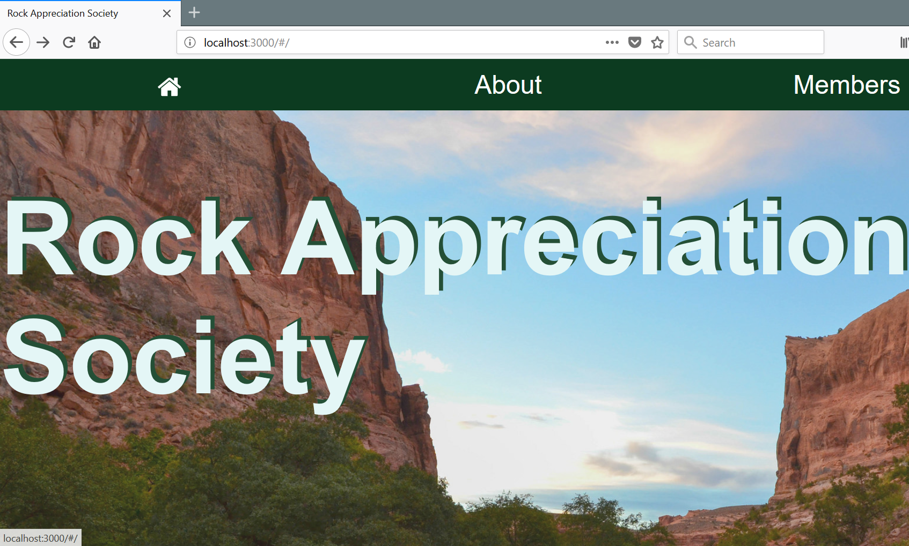
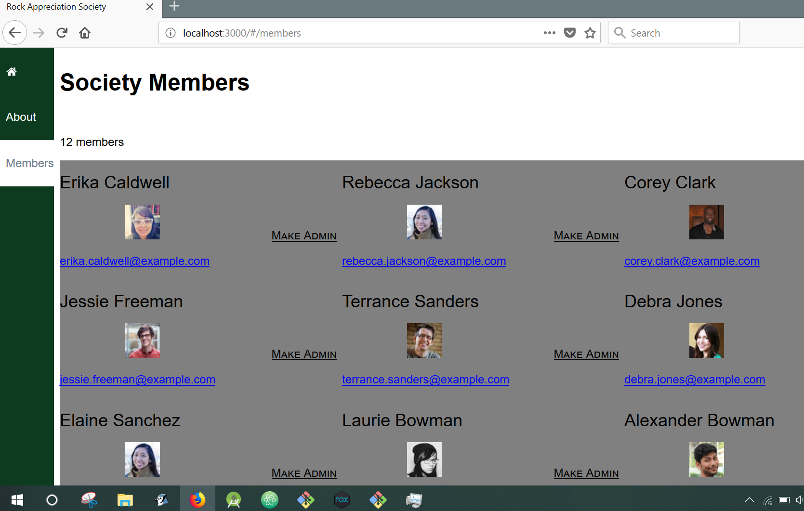

This is the follow-up lesson of Bulltin Board/react.js lesson. 
Review and new lessons
* Built with webpack
* Added and filtered data to a table
* Added react-icons and background image
* Incorporated the React Router
* Typechecked with PropTypes
* Reviewed the component life cycle

To run the Ski website:

Navigate to 

Ex_Files_React_EssT_Upd\Exercise Files\Ch06\06_05\start

Then run 

npm install

npm start

To run the Rock Appreciation website:

Navigate to 

Ex_Files_React_EssT_Upd\Exercise Files\Ch07\07_04\start

Then run 

npm install

npm start

		 
	
Page : https://www.lynda.com/React-js-tutorials/Pure-React/496905/573026-4.html
